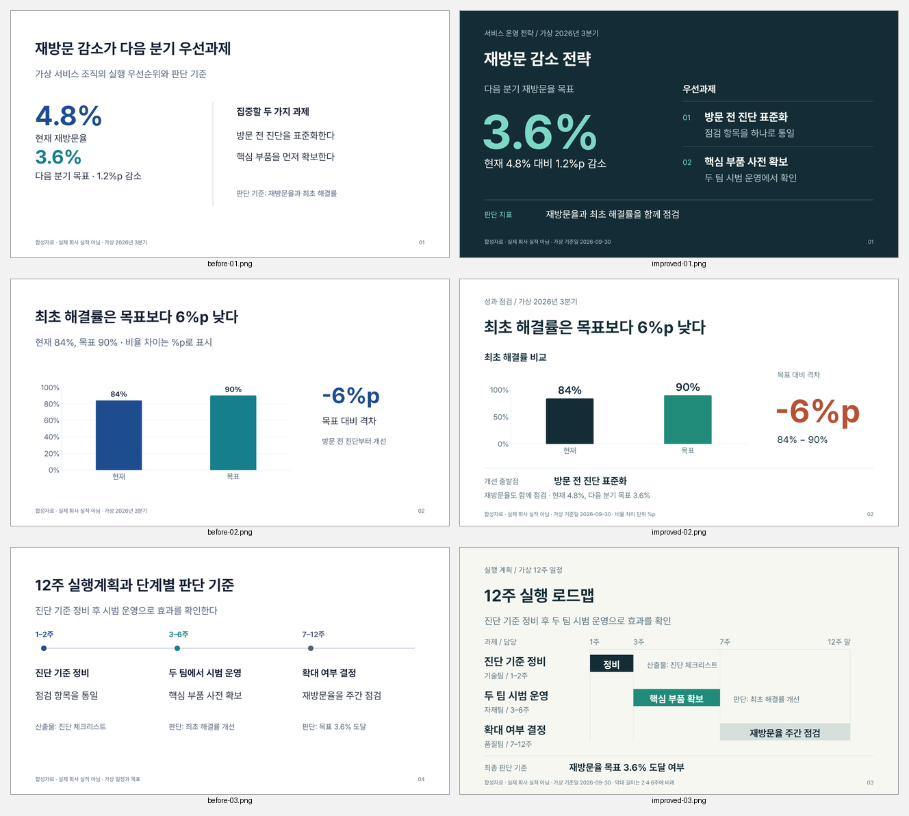

# 기본 디자인 개선 예시 3장

**합성자료로 만든 기본 디자인 개선 예시**다. 실제 회사 양식이나 사용자 정의
템플릿의 최종 스타일이 아니다. 기존 등록 템플릿과 원본 PPTX를 덮어쓰지 않는다.

[개선 PPTX](review/improved.pptx) · [1차 대표 3장 PPTX](review/before.pptx) ·
[전후 비교 PNG](review/before-after.png) · [검증 기록·해시](review/validation-summary.json)

왼쪽은 기존 6장 예시의 1·2·4장을 그대로 추출한 결과, 오른쪽은 재설계한 3장이다.
비교본의 원래 번호 01·02·04는 원본 증거 보존을 위해 그대로 두었다.

## 바꾼 정보 구조

| 페이지 | 1차의 문제 | 이번 구성 |
| --- | --- | --- |
| 전략 요약 | 현재·목표가 비슷한 무게로 쌓이고 핵심 목표가 약함 | 3.6% 목표를 가장 크게, 두 우선과제를 구분선으로 정렬 |
| KPI 비교 | 작은 수치·촘촘한 격자와 균일한 강조 | 직접 레이블32px, 고정0–100% 축, 큰 -6%p 격차와 개선 출발점 |
| 실행 로드맵 | 기간 길이가 다른데 동일 간격의 세 단락처럼 보임 | 2·4·6주에 비례하는 일정 막대, 담당·산출물·판단 기준을 행에 정렬 |

반복 카드를 추가하지 않고 캔버스의 큰 정보 구획, 정렬, 선과 글자 대비로 구분했다.
전략은 어두운 바탕, 성과는 흰 바탕, 로드맵은 따뜻한 흰 바탕으로 내용 흐름을 달리한다.
제목48px, 본문28px, 보조 레이블22px, 각주16px는 **이 예시의 기준**이다.
특정 회사의 제목14pt/본문12pt 요청을 전체 슬라이드에 적용하는 규칙이 아니다.

원본 합성 수치는 그대로다: 재방문율4.8%, 다음 분기 목표3.6%와 감소1.2%p,
최초 해결률84%, 목표90%와 차이-6%p, 가상 실행 단계1–2 /3–6 /7–12주.
새 예시의 기준일2026-09-30은 명확히 표시한 **가상 2026년3분기 기준일**이다.
기술·자재·품질팀은 기존 합성 실행표의 역할명이다.

## 실제로 본 참고 예시와 적용 원칙

- [Presenton Momentum 실제 업무 갤러리](https://github.com/presenton/presenton/blob/main/readme_assets/templates/Momentum.png):
  큰 제목과 본문 크기의 차이, 내용별 배치 변화, 지표 옆 해석의 관계를 참고했다.
- [Presenton Executive 실제 갤러리](https://github.com/presenton/presenton/blob/main/readme_assets/templates/Executive.png):
  절제한 색, 정렬, 일정/단계 구조를 참고했다.
- [upstream 공식 갤러리](https://hugohe3.github.io/ppt-master-examples/)의
  [실적 요약 예시](https://github.com/hugohe3/ppt-master-examples/blob/main/examples/_thumbs/ppt169_apple_fy2025_review.webp)와
  [전략 예시](https://github.com/hugohe3/ppt-master-examples/blob/main/examples/_thumbs/ppt169_ev_market_priorities.webp):
  숫자의 크기 대비, 결론과 근거 배치, 박스 없이 구분하는 행을 참고했다.

실제 이미지 검수와 참조 blob SHA는 [연구 기록](RESEARCH.md)에 있다.
로고·리본·사진·회사 사실·코드·원본 레이아웃을 복제하지 않았다.
이 기록은 스타순 전체 조사나 모든 예시의 우수성을 주장하는 벤치마크가 아니다.

## 편집 가능성과 검증

기존 SVG→DrawingML 변환기로 제작했다. 모든 텍스트와 로드맵 도형은 네이티브 객체,
KPI는 네이티브 Chart와 임베디드 Excel workbook이다. 전체 페이지를 이미지로 덮지 않았다.
양쪽 PPTX는 각3장, Chart1개, workbook1개, Master1개, 재사용 Layout1개다.
이번 3장에는 표가 없으며 기존6장의 네이티브 표 예시는 그대로 보존된다.

전후 SVG각3장 모두 template gate 오류/경고0. 공유 Presentations finalizer로
두 PPTX의 package/layout/폰트/차트 cache와 workbook/first-party import를 검증했다.
기존 OFL Pretendard Regular/Bold bytes를 지원 runtime에 등록해 최종6장을 렌더했고,
전 페이지를 개별 검수한 후 정확한 소스·폰트·PPTX·PNG에 연결된 agent review를 기록했다.
한글 누락, 텍스트 잘림, 의도하지 않은 겹침은 관찰하지 않았다. 비교 PNG도 확인했다.

초기 가로 막대 설계는 기존 exporter의 축 고정 미지원으로 거부되어, 정확한0–100%
비교를 지원하는 세로 막대로 조정했다. 새 엔진·유료 API·의존성 설치는 없다.

**사용 전 남은 검증:** PowerPoint 직접 열기와 Edit Data는 실행하지 않았다.
폰트가 임베딩되어 있지 않아 사용하는 환경에 글꼴 확인이 필요하다.
부모 세션의 HOME-PC 읽기 확인에서는 PowerPoint 설치와 1차 파일 구조는 확인했지만,
Pretendard는 Windows 글꼴 registry에서 발견하지 못했다. 따라서 이 PC의 동일한
글꼴 렌더는 보장하지 않는다. `font_families`에 원본/요청 글꼴을 선언해 수신 환경의
누락 경고를 확인한다. 클라우드에서 등록한 글꼴을 PC에 임의 설치·강제 대체하지 않는다.
회사 원형 재현은 실제 비공개 원본·샘플과 작업별 기준을 받은 뒤 별도로 확인한다.

## 재현

repo root에서 `template_preview_pptx.py`에 `before` 또는 `improved` workspace를
전달해 새 candidate filename으로 내보낸다. 공유 Presentations skill을 먼저 읽고
제공된 runtime 변수로 `finalize_review.mjs WORKSPACE CANDIDATE FINAL SHARED_SKILL_DIR`를
실행한다. 기존 `../render_review.mjs`에는 최종PPTX, render dir, 대응 profile와
shared skill dir를 전달한다. profile은3장과 정확한 기존 글꼴 bytes를 고정한다.
`business_quality.py`로 최종PPTX와 manifest를 검사하고 **실제 전 페이지 검수 후**
review를 기록한다. production deck의 picker/스토리라인 승인 절차는 그대로다.
