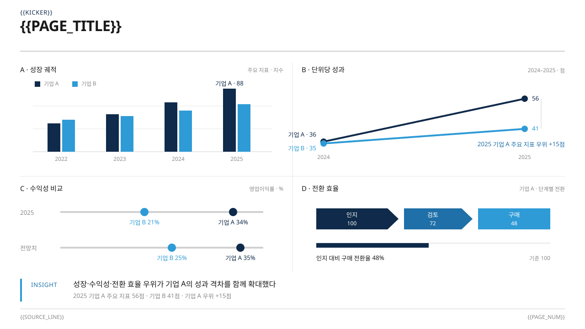
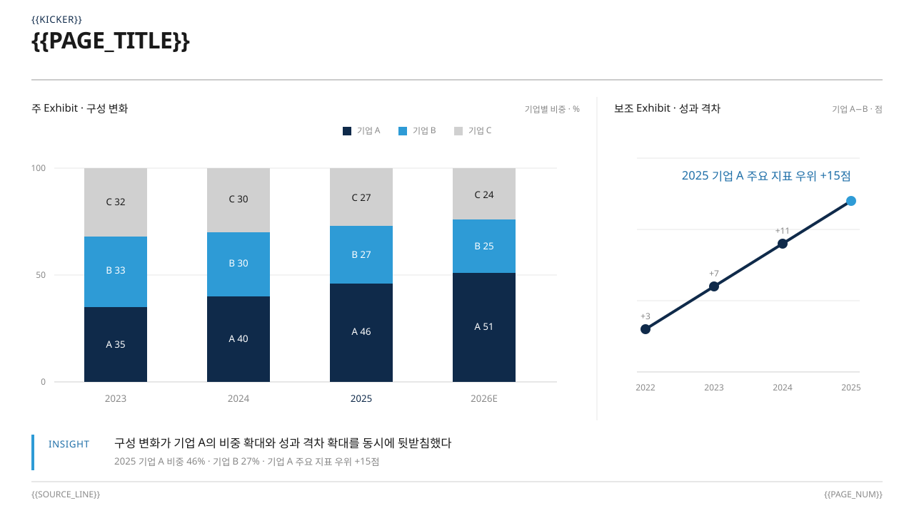

# Slide Master — Stable Visual Template Gallery

> ChatGPT의 HTML/JavaScript 렌더링 여부와 무관하게 GitHub에서 확인하는 안정형 템플릿 선택 화면입니다.
> 모든 미리보기는 저장소에 실제 등록된 SVG 원본을 직접 참조하며 임의 재디자인 이미지를 사용하지 않습니다.

## 선택 방법

1. 아래 실제 미리보기와 상세 레이아웃을 확인합니다.
2. 원하는 템플릿의 `선택 ID`를 복사합니다.
3. ChatGPT 대화창에 예: `deck:mckinsey 선택`이라고 보냅니다.
4. 사용자의 명시적 선택 전에는 새 PPT 생성이 시작되지 않습니다.

- 현재 등록 템플릿: **11개** + Free Design

# Deck Templates

## Apple Monochrome
- 선택 ID: `deck:apple`
- 요약: 제품 발표, 브랜드 스토리, 디자인 리뷰에 적합한 모노크롬 미니멀 키노트.

상세 레이아웃 보기

## JangPM Editorial
- 선택 ID: `deck:jangpm`
- 요약: 강의, 워크숍, 전략 브리핑, 분석 리포트용 에디토리얼 스타일.

상세 레이아웃 보기

## McKinsey Strategy
- 선택 ID: `deck:mckinsey`
- 요약: 전략 보고서, 시장·산업 분석, 경영진 브리핑, 실행 로드맵에 적합한 컨설팅 스타일.

상세 레이아웃 보기

## NAVER IR
- 선택 ID: `deck:naver_ir`
- 요약: 실적발표, 재무 보고, 투자자 미팅, KPI·데이터 중심 브리핑에 적합.

상세 레이아웃 보기

# Layout Templates

## Academic Defense
- 선택 ID: `layout:academic_defense`
- 요약: 논문 발표, 연구 진행 보고, 학술 발표용.

상세 레이아웃 보기

## Ai Ops
- 선택 ID: `layout:ai_ops`
- 요약: IT 시스템 개요, AI 운영 아키텍처, 디지털 전환 제안용.

상세 레이아웃 보기

## Government Blue
- 선택 ID: `layout:government_blue`
- 요약: 주요 사업 브리핑, 업무 요약, 정책·투자 설명용.

상세 레이아웃 보기

## Government Red
- 선택 ID: `layout:government_red`
- 요약: 정책 설명, 업무 요약, 프로젝트 소개용.

상세 레이아웃 보기

## Medical University
- 선택 ID: `layout:medical_university`
- 요약: 의료 학술 보고, 사례 토의, 연구 발표, 교육용.

상세 레이아웃 보기

## Pixel Retro
- 선택 ID: `layout:pixel_retro`
- 요약: 테크 토크, 프로그래밍 튜토리얼, 게임·기크 스타일 쇼케이스용.

상세 레이아웃 보기

## Psychology Attachment
- 선택 ID: `layout:psychology_attachment`
- 요약: 심리치료 교육, 학술 강의, 상담 사례 분석용.

상세 레이아웃 보기

# Free Design

- 선택 ID: `free`
- 설명: 등록 템플릿을 사용하지 않고 주제에 맞춰 새 디자인을 설계합니다.
- 자동 선택되지 않습니다. 사용자가 명시적으로 `free`를 선택해야 합니다.

## 운영 규칙

- 이 문서는 `decks_index.json`과 `layouts_index.json`의 등록 템플릿을 기준으로 관리합니다.
- 템플릿을 추가·수정·삭제한 뒤 `template_gallery_markdown.py`로 다시 생성하고 `--check`로 최신 상태를 검증합니다.
- 실제로 표시하지 못한 화면을 '열었다'거나 '표시했다'고 안내하지 않습니다.
- 사용자가 최종 선택 ID를 반환하기 전에는 새 PPT를 생성하지 않습니다.
